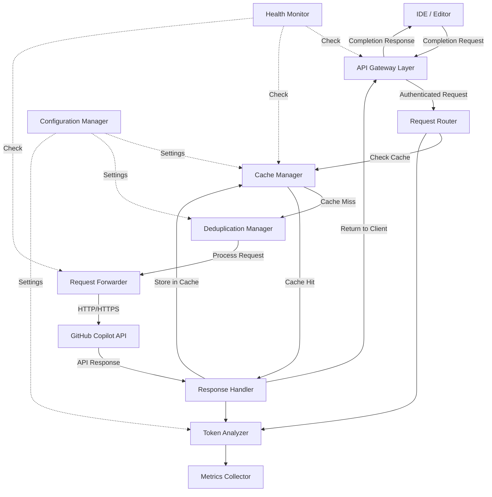

# Technical Design Document

## Overview

The GitHub Copilot Token Optimizer Proxy is a reverse proxy service that sits between developers' IDEs and the GitHub Copilot API. It intercepts completion requests, implements intelligent caching strategies, deduplicates simultaneous requests, and tracks token consumption to reduce API costs while maintaining response quality.

The proxy operates transparently to end users, requiring no changes to IDE configuration beyond pointing to the proxy endpoint instead of directly to GitHub Copilot. The system achieves token savings through multiple mechanisms:

1. **Exact cache matching**: Identical requests within 24 hours return cached responses
2. **Fuzzy cache matching**: Similar contexts (85%+ similarity) can reuse cached responses
3. **Request deduplication**: Simultaneous identical requests are coalesced
4. **Response optimization**: Compression and deduplication reduce storage and bandwidth

The design emphasizes low latency (sub-50ms proxy overhead), high availability (99.9% uptime), and graceful degradation when components fail.

## Architecture

The system follows a layered architecture with clear separation of concerns:



### Layer Responsibilities

**API Gateway Layer**
- Client authentication (API key verification)
- Request/response routing
- Error handling and status codes
- Connection management

**Request Processing Layer**
- Context extraction and normalization
- Context hashing (SHA-256)
- Cache lookup (exact and fuzzy matching)
- Request deduplication

**Caching Layer**
- Response storage and retrieval
- Cache eviction (LRU policy)
- TTL management (24-hour expiration)
- Compression/decompression

**Forwarding Layer**
- Connection pooling to GitHub Copilot API
- Request forwarding with token preservation
- Response handling and error propagation

**Analysis Layer**
- Token counting (tiktoken integration)
- Token budget tracking
- Metrics collection and aggregation

**Management Layer**
- Configuration hot-reloading
- Health monitoring
- Diagnostic endpoints

## Components and Interfaces

### 1. API Gateway

**Responsibility**: Handles all incoming HTTP connections from IDEs and outgoing responses.

**Interface**:
```typescript
interface APIGateway {
  // Handle incoming completion request
  handleCompletionRequest(req: HTTPRequest): Promise<HTTPResponse>
  
  // Verify client authentication
  authenticate(apiKey: string): Promise<AuthResult>
  
  // Route request to appropriate handler
  routeRequest(req: AuthenticatedRequest): Promise<HTTPResponse>
}

interface HTTPRequest {
  headers: Map<string, string>
  body: CompletionRequestBody
  clientIP: string
  timestamp: number
}

interface CompletionRequestBody {
  prompt: string
  language: string
  cursorPosition: number
  fileContext: string
  maxTokens?: number
}

interface AuthResult {
  authenticated: boolean
  userId: string
  copilotToken: string
}
```

**Key Behaviors**:
- Listens on configurable port (default: 8080)
- Validates request format before processing
- Returns appropriate HTTP status codes (200, 401, 502, 503)
- Maintains connection pool for concurrent requests

### 2. Request Processor

**Responsibility**: Extracts code context, normalizes it, and generates context hashes for cache lookups.

**Interface**:
```typescript
interface RequestProcessor {
  // Extract and normalize context from request
  extractContext(req: CompletionRequestBody): CodeContext
  
  // Generate SHA-256 hash of normalized context
  generateContextHash(context: CodeContext): string
  
  // Normalize whitespace and formatting
  normalizeContext(context: CodeContext): NormalizedContext
}

interface CodeContext {
  fileType: string
  precedingContent: string  // 500 chars before cursor
  followingContent: string  // 100 chars after cursor
  cursorPosition: number
  language: string
}

interface NormalizedContext {
  fileType: string
  precedingContent: string  // whitespace normalized
  followingContent: string  // whitespace normalized
  language: string
}
```

**Normalization Rules**:
- Collapse multiple consecutive whitespace to single space
- Remove leading/trailing whitespace per line
- Normalize line endings to LF
- Preserve indentation structure
- Convert tabs to spaces (4-space equivalent)

### 3. Cache Manager

**Responsibility**: Stores and retrieves cached Copilot responses with exact and fuzzy matching.

**Interface**:
```typescript
interface CacheManager {
  // Lookup exact cache match by context hash
  lookupExact(contextHash: string): Promise<CacheEntry | null>
  
  // Search for similar cache entries using fuzzy matching
  lookupSimilar(contextHash: string, threshold: number): Promise<CacheEntry | null>
  
  // Store response in cache
  store(contextHash: string, response: CopilotResponse, userId: string): Promise<void>
  
  // Check if cache entry is expired (> 24 hours)
  isExpired(entry: CacheEntry): boolean
  
  // Evict least recently used entries
  evictLRU(count: number): Promise<number>
  
  // Invalidate cache entries for user or all
  invalidate(userId?: string): Promise<number>
  
  // Calculate similarity score between contexts
  calculateSimilarity(hash1: string, hash2: string): number
}

interface CacheEntry {
  contextHash: string
  response: CompressedResponse
  timestamp: number
  userId: string
  accessCount: number
  lastAccessTime: number
  tokenCount: number
}

interface CompressedResponse {
  data: Buffer  // gzip-compressed JSON
  originalSize: number
  compressedSize: number
}
```

**Storage Strategy**:
- In-memory LRU cache using Map with doubly-linked list
- Maximum 10,000 entries (configurable)
- Redis as optional persistent backing store
- Compression using Node.js zlib (gzip level 6)

**Similarity Matching**:
- Calculate Levenshtein distance between normalized contexts
- Similarity score = 1 - (distance / max_length)
- Default threshold: 85%
- Search limited to recent 100 entries for performance

### 4. Deduplication Manager

**Responsibility**: Prevents duplicate simultaneous requests from hitting the API.

**Interface**:
```typescript
interface DeduplicationManager {
  // Check if request is a duplicate of in-flight request
  isDuplicate(contextHash: string): boolean
  
  // Register in-flight request
  registerRequest(contextHash: string): Promise<void>
  
  // Wait for existing request to complete
  waitForCompletion(contextHash: string): Promise<CopilotResponse>
  
  // Mark request as completed and notify waiters
  completeRequest(contextHash: string, response: CopilotResponse): void
  
  // Handle request failure
  failRequest(contextHash: string, error: Error): void
}

interface InFlightRequest {
  contextHash: string
  startTime: number
  waiters: Array<(response: CopilotResponse) => void>
  promise: Promise<CopilotResponse>
}
```

**Deduplication Logic**:
- Track in-flight requests by context hash
- Requests with same hash within 1 second are coalesced
- First request proceeds to API, others wait for response
- On completion, same response returned to all waiters
- On failure, next waiter becomes the primary request

### 5. Request Forwarder

**Responsibility**: Forwards requests to GitHub Copilot API with connection pooling.

**Interface**:
```typescript
interface RequestForwarder {
  // Forward request to GitHub Copilot API
  forward(req: ForwardRequest): Promise<CopilotResponse>
  
  // Check API availability
  checkHealth(): Promise<boolean>
  
  // Get connection pool statistics
  getPoolStats(): PoolStatistics
}

interface ForwardRequest {
  prompt: string
  language: string
  copilotToken: string
  maxTokens?: number
  temperature?: number
}

interface CopilotResponse {
  completions: Array<Completion>
  model: string
  tokenCount: number
}

interface Completion {
  text: string
  confidence: number
}

interface PoolStatistics {
  totalConnections: number
  activeConnections: number
  queuedRequests: number
  averageLatency: number
}
```

**Connection Pool Configuration**:
- Minimum 10 connections, maximum 20 connections
- Keep-alive enabled (120 seconds)
- Request timeout: 30 seconds
- Retry on transient failures (503, connection reset)
- Exponential backoff: 100ms, 200ms, 400ms

### 6. Token Analyzer

**Responsibility**: Counts tokens in requests and responses using tiktoken library.

**Interface**:
```typescript
interface TokenAnalyzer {
  // Count tokens in request prompt
  countRequestTokens(prompt: string): number
  
  // Count tokens in response completions
  countResponseTokens(completions: Array<Completion>): number
  
  // Calculate tokens saved by cache hit
  calculateSavings(requestTokens: number, responseTokens: number): number
  
  // Track token consumption for user
  recordConsumption(userId: string, tokens: number): void
  
  // Check if user is within token budget
  checkBudget(userId: string): BudgetStatus
}

interface BudgetStatus {
  consumed: number
  limit: number
  remaining: number
  percentUsed: number
  withinBudget: boolean
}
```

**Token Counting Implementation**:
- Use tiktoken library with cl100k_base encoding
- Count both prompt and completion tokens
- Cache token counts to avoid re-counting
- Track tokens per user per day
- Reset counters at midnight UTC

### 7. Metrics Collector

**Responsibility**: Collects and exposes metrics in Prometheus format.

**Interface**:
```typescript
interface MetricsCollector {
  // Record request processed
  recordRequest(cached: boolean, userId: string): void
  
  // Record response time
  recordLatency(milliseconds: number, endpoint: string): void
  
  // Record tokens consumed/saved
  recordTokens(consumed: number, saved: number, userId: string): void
  
  // Expose metrics in Prometheus format
  exportMetrics(): string
  
  // Get aggregated metrics
  getAggregatedMetrics(timeRange: TimeRange): MetricsSummary
}

interface MetricsSummary {
  totalRequests: number
  cacheHitRate: number
  averageLatency: number
  tokensConsumed: number
  tokensSaved: number
  savingsPercentage: number
  requestsPerSecond: number
}

interface TimeRange {
  start: Date
  end: Date
}
```

**Metrics Exposed**:
- `proxy_requests_total{status, cached}` - Counter of requests
- `proxy_cache_hit_rate` - Gauge of cache hit percentage
- `proxy_latency_milliseconds{endpoint}` - Histogram of latencies
- `proxy_tokens_consumed_total{user}` - Counter of API tokens used
- `proxy_tokens_saved_total{user}` - Counter of tokens saved
- `proxy_active_connections` - Gauge of active connections
- `proxy_cache_size` - Gauge of cache entry count
- `proxy_errors_total{type}` - Counter of errors by type

### 8. Configuration Manager

**Responsibility**: Loads and hot-reloads configuration from YAML file.

**Interface**:
```typescript
interface ConfigurationManager {
  // Load configuration from file
  loadConfig(path: string): Promise<Configuration>
  
  // Watch for configuration file changes
  watchConfig(callback: (config: Configuration) => void): void
  
  // Validate configuration values
  validateConfig(config: Configuration): ValidationResult
  
  // Get current configuration
  getCurrentConfig(): Configuration
}

interface Configuration {
  server: ServerConfig
  cache: CacheConfig
  tokens: TokenConfig
  similarity: SimilarityConfig
  security: SecurityConfig
}

interface ServerConfig {
  port: number
  host: string
  maxConcurrentRequests: number
  requestTimeoutMs: number
}

interface CacheConfig {
  ttlHours: number
  maxEntries: number
  compressionEnabled: boolean
  redisUrl?: string
}

interface TokenConfig {
  budgetPerUserPerDay?: number
  trackingEnabled: boolean
  warningThresholdPercent: number
}

interface SimilarityConfig {
  enabled: boolean
  threshold: number  // 0-100
  maxSearchEntries: number
}

interface SecurityConfig {
  apiKeyRequired: boolean
  encryptCache: boolean
  httpsOnly: boolean
}
```

**Hot-Reload Mechanism**:
- Watch config file using fs.watch()
- Debounce file changes (1 second delay)
- Validate new configuration before applying
- Apply changes atomically (all or nothing)
- Log configuration changes
- Preserve in-flight requests during reload

### 9. Health Monitor

**Responsibility**: Provides health check and diagnostic endpoints.

**Interface**:
```typescript
interface HealthMonitor {
  // Check overall service health
  checkHealth(): Promise<HealthStatus>
  
  // Get diagnostic information
  getDiagnostics(): DiagnosticInfo
  
  // Restart failed component
  restartComponent(name: string): Promise<boolean>
}

interface HealthStatus {
  healthy: boolean
  components: Map<string, ComponentHealth>
  uptime: number
}

interface ComponentHealth {
  name: string
  status: 'healthy' | 'degraded' | 'failed'
  lastError?: string
  lastCheck: Date
}

interface DiagnosticInfo {
  version: string
  uptime: number
  configuration: Configuration
  cacheStats: CacheStatistics
  poolStats: PoolStatistics
  metrics: MetricsSummary
}

interface CacheStatistics {
  size: number
  maxSize: number
  hitRate: number
  averageEntrySize: number
  compressionRatio: number
}
```

## Data Models

### Context Hash Generation

The context hash is a SHA-256 digest of the normalized code context:

```typescript
function generateContextHash(context: NormalizedContext): string {
  const components = [
    context.fileType,
    context.language,
    context.precedingContent,
    context.followingContent
  ]
  
  const concatenated = components.join('||')
  const hash = crypto.createHash('sha256')
  hash.update(concatenated)
  return hash.digest('hex')
}
```

### Cache Entry Schema

```typescript
interface CacheEntrySchema {
  // Primary key
  contextHash: string
  
  // Compressed response data
  response: {
    data: Buffer
    originalSize: number
    compressedSize: number
  }
  
  // Metadata
  timestamp: number
  userId: string
  accessCount: number
  lastAccessTime: number
  
  // Token tracking
  requestTokens: number
  responseTokens: number
  
  // Context snapshot (for similarity matching)
  normalizedContext?: string  // stored only if similarity matching enabled
}
```

### Token Budget Tracking Schema

```typescript
interface TokenBudgetSchema {
  // Composite key: userId + date
  userId: string
  date: string  // YYYY-MM-DD format
  
  // Consumption tracking
  tokensConsumed: number
  tokensFromCache: number
  tokensSaved: number
  
  // Request counters
  totalRequests: number
  cachedRequests: number
  apiRequests: number
  
  // Budget status
  budgetLimit?: number
  withinBudget: boolean
  
  // Timestamps
  firstRequest: number
  lastRequest: number
}
```

### In-Flight Request Tracking

```typescript
interface InFlightRequestSchema {
  // Primary key
  contextHash: string
  
  // Request state
  startTime: number
  status: 'pending' | 'completed' | 'failed'
  
  // Response (populated on completion)
  response?: CopilotResponse
  error?: Error
  
  // Waiters
  waiters: Array<{
    requestId: string
    timestamp: number
    resolve: (response: CopilotResponse) => void
    reject: (error: Error) => void
  }>
}
```

## Correctness Properties

*A property is a characteristic or behavior that should hold true across all valid executions of a system—essentially, a formal statement about what the system should do. Properties serve as the bridge between human-readable specifications and machine-verifiable correctness guarantees.*

### Property Reflection

After analyzing all acceptance criteria, I've identified the following redundancies and consolidations:

**Redundancies Identified:**
- Requirements 3.3 and 3.4 (cache TTL handling) can be combined into a single property about TTL-based cache validity
- Requirements 5.1, 5.2, and 5.3 (deduplication) can be consolidated into one comprehensive deduplication property
- Requirements 7.1 and 7.2 (compression/decompression) are a round-trip property that can be combined
- Requirements 12.1 and 12.2 (authentication) can be merged into a single authentication enforcement property
- Requirements 15.1, 15.2, and 15.3 (graceful degradation) can be consolidated into one property about component failure handling

**Properties to Create:**
Based on the prework analysis, I will create properties for the following PROPERTY-classified criteria, with redundancies eliminated:
- Request/response format preservation (1.4, 1.5 combined)
- Context extraction and hashing (2.1, 2.2, 2.4 combined)
- Whitespace normalization equivalence (2.3)
- Cache storage and retrieval round-trip (3.1)
- Cache TTL handling (3.3, 3.4 combined)
- LRU eviction ordering (3.6)
- Token savings calculation (4.4, 4.5 combined)
- Request deduplication (5.1, 5.2, 5.3, 5.5 combined)
- Similarity matching (6.1, 6.2, 6.3 combined)
- Compression round-trip (7.1, 7.2 combined)
- Response deduplication (7.4)
- Token budget tracking (8.1, 8.3 combined)
- Metrics tracking (9.1, 9.2, 9.3 combined)
- Metrics retention (9.5)
- Configuration validation and fallback (10.2, 10.5 combined)
- Error logging format (11.4)
- Authentication enforcement (12.1, 12.2, 12.6 combined)
- Token forwarding (12.3)
- Encryption round-trip (12.4)
- Context isolation (13.2)
- Timeout handling (13.5)
- Cache invalidation (14.2, 14.5 combined)
- Component failure handling (15.1, 15.2, 15.3, 15.4 combined)
- API unavailability fallback (15.6)

### Property 1: Request and Response Format Preservation

*For any* valid completion request and corresponding API response (including errors), when forwarded through the proxy, the request format sent to GitHub Copilot and the response format returned to the IDE SHALL remain unchanged from their original structure, including all headers, body fields, and error codes.

**Validates: Requirements 1.4, 1.5**

### Property 2: Context Extraction Completeness

*For any* valid completion request, the context extraction process SHALL produce a context object containing all required fields (file type, language, cursor position, preceding 500 characters, following 100 characters), and any change to these input fields SHALL result in a different context hash.

**Validates: Requirements 2.1, 2.2, 2.4**

### Property 3: Whitespace Normalization Equivalence

*For any* two code contexts that differ only in whitespace formatting (spaces vs tabs, multiple consecutive spaces, leading/trailing whitespace), the normalization process SHALL produce identical context hashes, while contexts with different semantic content SHALL produce different hashes.

**Validates: Requirements 2.3**

### Property 4: Cache Storage and Retrieval Round-Trip

*For any* valid Copilot response, if stored in the cache with a context hash, then retrieving by that same context hash SHALL return an equivalent response with all completion data preserved, including after compression and decompression.

**Validates: Requirements 3.1**

### Property 5: Cache TTL Validity

*For any* cache entry, if the entry timestamp is less than 24 hours old, then the cache lookup SHALL return the cached response; if the entry timestamp is 24 hours or older, then the cache lookup SHALL treat the entry as expired and not return it.

**Validates: Requirements 3.3, 3.4**

### Property 6: LRU Eviction Ordering

*For any* sequence of cache accesses, when the cache reaches maximum capacity and a new entry must be stored, the eviction algorithm SHALL remove the entry with the oldest lastAccessTime before all entries with more recent access times.

**Validates: Requirements 3.6**

### Property 7: Token Savings Calculation

*For any* cached response, the token savings calculation SHALL equal the sum of request tokens and response tokens that would have been consumed by calling the GitHub Copilot API, and cumulative token savings SHALL equal the sum of all individual savings events since service start.

**Validates: Requirements 4.4, 4.5**

### Property 8: Request Deduplication

*For any* set of completion requests with identical context hashes received within 1 second, only the first request SHALL result in a call to the GitHub Copilot API, all subsequent requests SHALL wait for the first to complete, all requests SHALL receive the same response, and if the first request fails, the next queued request SHALL become the primary request.

**Validates: Requirements 5.1, 5.2, 5.3, 5.5**

### Property 9: Similarity Matching

*For any* completion request where no exact cache match exists and similarity matching is enabled, the cache search SHALL calculate similarity scores for recent entries, and if any entry has a similarity score above the configured threshold (default 85%), that entry SHALL be returned; otherwise, no similar match SHALL be returned.

**Validates: Requirements 6.1, 6.2, 6.3**

### Property 10: Compression Round-Trip

*For any* Copilot response, compressing the response data with gzip and then decompressing it SHALL produce data identical to the original response, preserving all completions and metadata.

**Validates: Requirements 7.1, 7.2**

### Property 11: Response Deduplication

*For any* Copilot response containing multiple completion suggestions, if two or more suggestions have identical text content, the deduplication process SHALL remove all duplicates, retaining only one instance of each unique completion.

**Validates: Requirements 7.4**

### Property 12: Token Budget Enforcement

*For any* user with a configured token budget, the proxy SHALL track cumulative token consumption per day, and if consumption reaches or exceeds the budget limit, all subsequent requests SHALL be served only from cache (if available) and new API calls SHALL be rejected with an appropriate error.

**Validates: Requirements 8.1, 8.3**

### Property 13: Metrics Tracking Accuracy

*For any* sequence of requests processed by the proxy, the metrics collector SHALL maintain accurate counters such that total_requests equals cache_hits plus cache_misses, tokens_saved equals the sum of all cache-hit savings, and aggregations per user, per hour, and per day SHALL correctly sum the constituent events within each time bucket.

**Validates: Requirements 9.1, 9.2, 9.3**

### Property 14: Metrics Retention Window

*For any* metric data point with a timestamp older than 30 days from the current time, that data point SHALL be removed from storage, and all data points within the 30-day window SHALL be retained and queryable.

**Validates: Requirements 9.5**

### Property 15: Configuration Validation and Fallback

*For any* configuration file, if all parameter values are valid according to their type and range constraints, the configuration SHALL be applied; if any parameter is invalid, the proxy SHALL log an error and continue using the previous valid configuration without interruption.

**Validates: Requirements 10.2, 10.5**

### Property 16: Error Logging Completeness

*For any* error that occurs during proxy operation, the logged error record SHALL include a timestamp, error type/code, error message, and sufficient context to diagnose the issue.

**Validates: Requirements 11.4**

### Property 17: Authentication Enforcement

*For any* incoming connection, if a valid API key is not provided, the proxy SHALL reject the connection with HTTP 401 Unauthorized; if a valid API key is provided, the connection SHALL be accepted and the client's requests SHALL be processed.

**Validates: Requirements 12.1, 12.2, 12.6**

### Property 18: Token Forwarding Preservation

*For any* authenticated request containing a GitHub Copilot authentication token, the proxy SHALL forward that exact token to the GitHub Copilot API without modification, and the API response SHALL correspond to that user's Copilot account.

**Validates: Requirements 12.3**

### Property 19: Cache Encryption Round-Trip

*For any* cache data, encrypting the data with AES-256 and then decrypting it SHALL produce data identical to the original, preserving all response content and metadata.

**Validates: Requirements 12.4**

### Property 20: Concurrent Request Context Isolation

*For any* set of concurrent requests with different context hashes, the processing of each request SHALL maintain separate context state such that modifications or errors in one request do not affect the context, responses, or error handling of other concurrent requests.

**Validates: Requirements 13.2**

### Property 21: Request Timeout Error Handling

*For any* request that waits in the queue longer than the configured timeout (5 seconds), the proxy SHALL return HTTP 503 Service Unavailable to the client without processing the request further.

**Validates: Requirements 13.5**

### Property 22: Cache Invalidation Completeness

*For any* cache invalidation request specifying a user identifier, all cache entries belonging to that user SHALL be removed and the returned count SHALL equal the number of removed entries; for a global invalidation request, all cache entries SHALL be removed regardless of user.

**Validates: Requirements 14.2, 14.5**

### Property 23: Graceful Component Failure Handling

*For any* non-critical component failure (Cache Manager, Token Analyzer, or Metrics Collector), the proxy SHALL log the error, continue processing requests with the failed component bypassed (forwarding directly to API for cache failures, skipping tracking for analyzer failures, skipping collection for metrics failures), and the service SHALL remain available for request processing.

**Validates: Requirements 15.1, 15.2, 15.3, 15.4**

### Property 24: API Unavailability Fallback

*For any* request when the GitHub Copilot API is unavailable, if a valid cached response exists for the request context, the proxy SHALL return the cached response; if no cached response exists, the proxy SHALL return HTTP 502 Bad Gateway to indicate the upstream service is unavailable.

**Validates: Requirements 15.6**


## Error Handling

The proxy implements a comprehensive error handling strategy to ensure graceful degradation and clear error communication.

### Error Categories

**1. Client Errors (4xx)**

- **401 Unauthorized**: Invalid or missing API key
  - Response: `{"error": "Authentication failed", "code": "AUTH_FAILED"}`
  - Action: Client must provide valid API key

- **400 Bad Request**: Malformed request body or missing required fields
  - Response: `{"error": "Invalid request format", "code": "INVALID_REQUEST", "details": "..."}`
  - Action: Client must correct request format

- **429 Too Many Requests**: Token budget exceeded
  - Response: `{"error": "Token budget exceeded", "code": "BUDGET_EXCEEDED", "resetTime": "2024-01-02T00:00:00Z"}`
  - Action: Client must wait for budget reset or use cached responses only

**2. Server Errors (5xx)**

- **500 Internal Server Error**: Unexpected proxy error
  - Response: `{"error": "Internal server error", "code": "INTERNAL_ERROR", "requestId": "..."}`
  - Action: Error logged, client should retry with exponential backoff

- **502 Bad Gateway**: GitHub Copilot API unavailable
  - Response: `{"error": "Upstream service unavailable", "code": "UPSTREAM_UNAVAILABLE"}`
  - Action: Proxy attempts cache fallback; client should retry

- **503 Service Unavailable**: Request queue full or timeout
  - Response: `{"error": "Service temporarily unavailable", "code": "SERVICE_BUSY", "retryAfter": 5}`
  - Action: Client should respect retryAfter header

**3. Component Errors**

When non-critical components fail, the proxy continues operation with degraded functionality:

- **Cache Manager Failure**: All requests bypass cache and forward to API
  - Logged: `ERROR: Cache manager failure: <details>`
  - Impact: Increased token consumption, no caching

- **Token Analyzer Failure**: Requests processed without token counting
  - Logged: `ERROR: Token analyzer failure: <details>`
  - Impact: No token tracking or budget enforcement

- **Metrics Collector Failure**: Requests processed without metrics
  - Logged: `ERROR: Metrics collector failure: <details>`
  - Impact: No metrics available at /metrics endpoint

- **Configuration Reload Failure**: Previous valid configuration retained
  - Logged: `ERROR: Config validation failed: <details>`
  - Impact: New configuration not applied

### Error Recovery

**Automatic Recovery**:
- Failed components attempt automatic restart every 60 seconds
- Connection pool recreates failed connections automatically
- Configuration file watcher continues monitoring after invalid config

**Circuit Breaker**:
- GitHub Copilot API calls use circuit breaker pattern
- After 5 consecutive failures, circuit opens for 30 seconds
- During open circuit, only cached responses served
- Half-open state: single test request before full recovery

**Timeout Handling**:
- Request processing timeout: 5 seconds
- API call timeout: 30 seconds
- Cache operation timeout: 5 milliseconds (operation skipped if exceeded)
- Configuration reload timeout: 10 seconds

### Logging Strategy

**Log Levels**:

- **DEBUG**: All request hashes, cache decisions, configuration changes
- **INFO**: Request counts, cache hit rates, successful operations
- **WARN**: Token budget warnings (90% threshold), degraded mode, slow operations
- **ERROR**: Component failures, API errors, validation failures

**Structured Logging Format**:
```json
{
  "timestamp": "2024-01-01T12:00:00.000Z",
  "level": "ERROR",
  "component": "CacheManager",
  "message": "Cache operation failed",
  "error": {
    "type": "RedisConnectionError",
    "message": "Connection refused",
    "stack": "..."
  },
  "context": {
    "operation": "store",
    "contextHash": "abc123...",
    "userId": "user-123"
  },
  "requestId": "req-456"
}
```

**Sensitive Data Handling**:
- Never log API keys or authentication tokens
- Never log complete code context at INFO/WARN/ERROR levels
- At DEBUG level, log context hashes only, not full code content
- Mask user identifiers in production logs (optional configuration)

## Testing Strategy

The GitHub Copilot Token Optimizer Proxy requires comprehensive testing across multiple dimensions: correctness, performance, reliability, and security.

### Property-Based Testing

Property-based testing is appropriate for this feature because it involves complex data transformations, caching logic, and algorithms that should work correctly across a wide range of inputs.

**Testing Library**: fast-check (JavaScript/TypeScript property-based testing library)

**Test Configuration**:
- Minimum 100 iterations per property test
- Each test tagged with comment referencing design property
- Tag format: `// Feature: copilot-token-optimizer-proxy, Property N: <property text>`

**Property Test Implementation**:

Each of the 24 correctness properties defined in the previous section SHALL be implemented as a property-based test. Key testing approaches:

1. **Format Preservation (Properties 1, 10, 19)**:
   - Generate random request/response structures
   - Verify round-trip operations preserve data
   - Test with various data sizes and complexity

2. **Context Hashing (Properties 2, 3)**:
   - Generate random code contexts with varying whitespace
   - Verify normalization produces consistent hashes
   - Test hash collision resistance

3. **Cache Operations (Properties 4, 5, 6)**:
   - Generate random cache access patterns
   - Verify LRU eviction correctness
   - Test TTL boundaries and expiration

4. **Deduplication (Properties 8, 11)**:
   - Generate concurrent request scenarios
   - Verify coalescing and response distribution
   - Test failure recovery

5. **Token Analysis (Properties 7, 12)**:
   - Generate random token counts
   - Verify savings calculations
   - Test budget enforcement logic

6. **Error Handling (Properties 17, 21, 23, 24)**:
   - Generate various error conditions
   - Verify correct error codes and fallback behavior
   - Test graceful degradation

**Example Property Test**:
```typescript
// Feature: copilot-token-optimizer-proxy, Property 3: Whitespace normalization equivalence
describe('Context Normalization', () => {
  it('produces identical hashes for contexts differing only in whitespace', () => {
    fc.assert(
      fc.property(
        fc.string(), // base code content
        fc.array(fc.constantFrom(' ', '\t', '\n', '  ')), // whitespace variations
        (code, whitespace) => {
          const context1 = { fileType: 'ts', precedingContent: code, followingContent: '' }
          const context2 = { fileType: 'ts', precedingContent: addWhitespace(code, whitespace), followingContent: '' }
          
          const hash1 = generateContextHash(normalizeContext(context1))
          const hash2 = generateContextHash(normalizeContext(context2))
          
          return hash1 === hash2
        }
      ),
      { numRuns: 100 }
    )
  })
})
```

### Unit Testing

Unit tests complement property-based tests by covering specific examples, edge cases, and component integration.

**Unit Test Coverage**:

1. **Request Processing**:
   - Valid request extraction (example prompts)
   - Invalid request handling (malformed JSON, missing fields)
   - Boundary conditions (empty context, maximum size prompts)

2. **Cache Management**:
   - Exact match lookup with known hashes
   - Cache entry expiration at 24-hour boundary
   - Eviction with capacity of exactly 10,000 entries
   - Empty cache behavior

3. **Token Analysis**:
   - Known token counts for sample prompts (using tiktoken)
   - Budget threshold warnings at 90%
   - Budget reset at midnight UTC (mocked time)
   - Zero token handling

4. **Configuration**:
   - Valid YAML parsing with all supported parameters
   - Invalid configuration rejection (wrong types, out-of-range values)
   - Configuration hot-reload without dropping connections

5. **Metrics**:
   - Prometheus format validation
   - Counter increment accuracy
   - Aggregation bucket correctness (hourly, daily)
   - Retention cleanup at 30-day boundary

6. **Health Monitoring**:
   - /health endpoint returns 200 when healthy
   - /diagnostics endpoint includes all required fields
   - Component health check accuracy

7. **Authentication**:
   - Valid API key acceptance
   - Invalid API key rejection with 401
   - Token forwarding to API

**Example Unit Test**:
```typescript
describe('Cache Manager', () => {
  it('returns cached response for entries less than 24 hours old', () => {
    const cache = new CacheManager({ maxEntries: 1000, ttlHours: 24 })
    const contextHash = 'abc123'
    const response = { completions: [{ text: 'test', confidence: 0.9 }] }
    const twentyThreeHoursAgo = Date.now() - (23 * 60 * 60 * 1000)
    
    cache.store(contextHash, response, 'user1', twentyThreeHoursAgo)
    const result = cache.lookupExact(contextHash)
    
    expect(result).not.toBeNull()
    expect(result.response).toEqual(response)
  })
  
  it('treats entries older than 24 hours as expired', () => {
    const cache = new CacheManager({ maxEntries: 1000, ttlHours: 24 })
    const contextHash = 'abc123'
    const response = { completions: [{ text: 'test', confidence: 0.9 }] }
    const twentyFiveHoursAgo = Date.now() - (25 * 60 * 60 * 1000)
    
    cache.store(contextHash, response, 'user1', twentyFiveHoursAgo)
    const result = cache.lookupExact(contextHash)
    
    expect(result).toBeNull()
  })
})
```

### Integration Testing

Integration tests verify end-to-end behavior and component interactions.

**Integration Test Scenarios**:

1. **Full Request Flow**:
   - IDE → Proxy → GitHub Copilot API → Proxy → IDE
   - Verify request reaches API with correct format
   - Verify response returns to IDE unchanged
   - Measure end-to-end latency (< 70ms proxy overhead target)

2. **Cache Hit Flow**:
   - First request: cache miss → API call → cache store
   - Second identical request: cache hit → no API call
   - Verify token savings recorded
   - Verify metrics updated correctly

3. **Deduplication Flow**:
   - Send 5 identical requests simultaneously
   - Verify only 1 API call made
   - Verify all 5 requests receive same response
   - Measure response time for duplicates

4. **Fuzzy Matching Flow**:
   - Store response for context A
   - Request context B (85% similar to A)
   - Verify fuzzy match returns cached response
   - Verify similarity score logged

5. **Budget Enforcement Flow**:
   - Configure user token budget
   - Make requests until budget reached
   - Verify requests rejected with 429 error
   - Verify cache-only responses still work

6. **Graceful Degradation Flow**:
   - Simulate cache failure
   - Verify requests still processed via API
   - Verify error logged
   - Simulate cache recovery
   - Verify caching resumes

7. **Configuration Reload Flow**:
   - Start proxy with initial config
   - Make requests to establish baseline
   - Modify config file (change cache TTL)
   - Wait for reload (< 10 seconds)
   - Verify new config applied
   - Verify existing connections not dropped

8. **API Unavailability Flow**:
   - Store cached response
   - Simulate GitHub Copilot API outage
   - Request with cache match: verify cached response returned
   - Request without cache match: verify 502 error returned
   - Simulate API recovery
   - Verify normal operation resumes

**Integration Test Setup**:
- Use test doubles (mocks) for GitHub Copilot API
- Use in-memory cache (no Redis) for faster tests
- Mock time for TTL and budget reset tests
- Use test API keys for authentication
- Measure latencies and verify performance requirements

### Performance Testing

Performance tests verify the proxy meets latency and throughput requirements.

**Performance Benchmarks**:

1. **Cache Lookup Latency**: < 5ms (p95)
   - Measure time from lookup start to result return
   - Test with cache sizes: 100, 1000, 10000 entries
   - Test with exact and fuzzy matching

2. **Request Forwarding Overhead**: < 50ms (p95)
   - Measure proxy latency vs direct API call
   - Test with various request sizes
   - Test with and without caching

3. **Token Analysis Latency**: < 5ms (p95)
   - Measure time to count tokens in request and response
   - Test with prompts of varying lengths

4. **Total Proxy Overhead**: < 70ms (p95)
   - Measure end-to-end latency including all proxy operations
   - Test with cache hits and cache misses
   - Test with concurrent requests

5. **Throughput**: 1000 requests/minute minimum
   - Measure requests per second under load
   - Test with 100 concurrent users
   - Monitor for degradation over time

6. **Compression Performance**: Complete in < 10ms
   - Measure compression and decompression time
   - Test with responses of varying sizes
   - Verify 40% compression ratio achieved

7. **Similarity Search Performance**: < 15ms
   - Measure time for fuzzy matching search
   - Test with various cache sizes
   - Test with different similarity thresholds

**Load Testing**:
- Ramp up to 100 concurrent users
- Sustain 1000 requests/minute for 10 minutes
- Monitor for memory leaks, CPU usage, connection pool exhaustion
- Verify graceful degradation under overload (503 responses)

### Security Testing

Security tests verify authentication, encryption, and data protection.

**Security Test Coverage**:

1. **Authentication**:
   - Verify requests without API key rejected (401)
   - Verify requests with invalid API key rejected (401)
   - Verify requests with valid API key accepted (200/2xx)
   - Test for timing attacks on API key validation

2. **Token Protection**:
   - Verify Copilot tokens not logged at INFO level
   - Verify tokens forwarded to API without modification
   - Verify tokens not stored in cache metadata

3. **Cache Encryption**:
   - Verify cached data encrypted at rest (AES-256)
   - Verify decryption produces original data
   - Verify cache files not readable without decryption key

4. **HTTPS Enforcement**:
   - Verify proxy only connects to Copilot API via HTTPS
   - Verify HTTP API URLs rejected
   - Verify certificate validation enabled

5. **Input Validation**:
   - Test with malformed JSON payloads
   - Test with extremely large requests (DoS prevention)
   - Test with special characters and injection attempts
   - Verify all inputs sanitized before logging

6. **Rate Limiting**:
   - Test token budget enforcement per user
   - Verify concurrent request limits enforced
   - Test queue overflow handling

### Test Execution

**Continuous Integration**:
- Run all unit tests on every commit
- Run property tests (100 iterations) on every commit
- Run integration tests on every pull request
- Run performance benchmarks nightly
- Run security tests before release

**Test Environment**:
- Node.js 18+ (LTS version)
- In-memory cache for unit/property tests
- Redis container for integration tests
- Mocked GitHub Copilot API for all tests
- Test coverage target: 80% line coverage

**Test Data**:
- Use realistic code snippets for context testing
- Generate varied request sizes (1KB to 100KB)
- Test with multiple programming languages (TypeScript, Python, Java, Go)
- Use representative Copilot response formats

## Deployment Considerations

### Infrastructure Requirements

**Compute**:
- 2 vCPU, 4GB RAM minimum (supports 100 concurrent users)
- 4 vCPU, 8GB RAM recommended (supports 500+ concurrent users)
- Auto-scaling based on CPU (> 70%) or queue depth (> 50)

**Storage**:
- 10GB minimum for logs and persistent cache
- SSD recommended for cache performance
- Optional: Redis cluster for distributed caching

**Network**:
- Low-latency connection to GitHub Copilot API (< 20ms preferred)
- TLS 1.2+ support for HTTPS
- Firewall rules: allow outbound 443 to GitHub domains

### Deployment Architecture

**Single-Instance Deployment**:
```
IDE → Load Balancer → Proxy Instance → GitHub Copilot API
                         ↓
                    In-Memory Cache
```
- Suitable for small teams (< 100 users)
- No shared state, simpler deployment
- Cache not shared across instances

**Multi-Instance Deployment**:
```
              Load Balancer
             /      |      \
          Proxy  Proxy  Proxy
            \      |      /
             Redis Cluster
                  |
          GitHub Copilot API
```
- Suitable for large teams (500+ users)
- Shared cache via Redis improves hit rate
- Horizontal scaling for throughput
- Session affinity not required

### Configuration Management

**Environment Variables**:
- `PROXY_PORT`: Server port (default: 8080)
- `PROXY_HOST`: Bind address (default: 0.0.0.0)
- `COPILOT_API_URL`: GitHub Copilot API endpoint
- `REDIS_URL`: Redis connection string (optional)
- `CONFIG_FILE`: Path to YAML configuration file

**Configuration File** (config.yaml):
```yaml
server:
  port: 8080
  host: 0.0.0.0
  maxConcurrentRequests: 100
  requestTimeoutMs: 5000

cache:
  ttlHours: 24
  maxEntries: 10000
  compressionEnabled: true
  redisUrl: redis://localhost:6379  # optional

tokens:
  budgetPerUserPerDay: 100000  # optional, omit for unlimited
  trackingEnabled: true
  warningThresholdPercent: 90

similarity:
  enabled: true
  threshold: 85
  maxSearchEntries: 100

security:
  apiKeyRequired: true
  encryptCache: true
  httpsOnly: true

logging:
  level: INFO
  format: json
  outputFile: /var/log/proxy/app.log
```

### Monitoring and Observability

**Metrics Endpoint**: `GET /metrics`
- Prometheus-compatible format
- Scrape interval: 15 seconds
- Retention: 30 days

**Health Endpoint**: `GET /health`
- Returns 200 when all components healthy
- Returns 503 during degraded operation
- Liveness probe: check every 10 seconds

**Diagnostics Endpoint**: `GET /diagnostics`
- Requires admin authentication
- Returns cache stats, config, uptime
- Use for troubleshooting

**Alerting Thresholds**:
- Cache hit rate < 50% (may need config tuning)
- Average latency > 100ms (performance degradation)
- Error rate > 5% (investigate component failures)
- Token budget exceeded for multiple users (capacity planning)
- Component restart failures > 3 (manual intervention needed)

### Operational Procedures

**Deployment Process**:
1. Deploy new version with updated config
2. Health check passes before routing traffic
3. Gradual rollout (10% → 50% → 100%)
4. Monitor error rates and latency during rollout
5. Rollback if error rate > 1% or latency > 150ms

**Cache Invalidation**:
- Global: `POST /cache/invalidate` (admin only)
- Per-user: `POST /cache/invalidate?userId=<id>` (admin only)
- Use when code context changes significantly (e.g., major refactoring)

**Configuration Updates**:
1. Modify config.yaml in deployed environment
2. Service auto-reloads within 10 seconds
3. Monitor logs for "Config reloaded" message
4. If validation fails, previous config remains active

**Troubleshooting**:
- Check `/health` for component status
- Check `/diagnostics` for cache and pool statistics
- Set log level to DEBUG for detailed request tracing
- Monitor metrics for cache hit rates and latency trends
- Review logs for component failure messages

### Disaster Recovery

**Backup Strategy**:
- Cache data: not critical, can be rebuilt
- Configuration: version-controlled in Git
- Metrics: retained 30 days, export to long-term storage if needed
- Logs: ship to centralized logging (CloudWatch, ELK, etc.)

**Recovery Procedures**:
- Instance failure: auto-scaling launches replacement
- Redis failure: proxy falls back to in-memory cache
- API unavailability: serve cached responses, return 502 for cache misses
- Complete outage: redeploy from infrastructure-as-code, service recovers automatically

## Technology Stack

### Core Dependencies

**Runtime**: Node.js 18+ LTS
- Async I/O for high concurrency
- Mature HTTP libraries (undici, node-http-proxy)
- Native crypto support for hashing and encryption

**Web Framework**: Express.js 4.x or Fastify 4.x
- Fastify preferred for performance (faster routing, lower overhead)
- Built-in schema validation
- Plugin architecture for modularity

**HTTP Client**: undici
- HTTP/1.1 and HTTP/2 support
- Connection pooling built-in
- Better performance than node-fetch or axios

**Caching**:
- In-memory: Node.js Map + custom LRU implementation
- Distributed: ioredis (Redis client)
- Compression: zlib (Node.js built-in)

**Token Counting**: tiktoken
- Official OpenAI tokenizer
- cl100k_base encoding (GPT-3.5/GPT-4 compatible)
- WebAssembly-based for performance

**Metrics**: prom-client
- Prometheus client library
- Counter, Gauge, Histogram support
- Express/Fastify middleware available

**Configuration**: js-yaml
- YAML parsing and validation
- Watch file changes with chokidar

**Testing**:
- Unit/Integration: Jest or Vitest
- Property-based: fast-check
- Load testing: k6 or Artillery
- Mocking: nock (HTTP mocking)

**Logging**: pino
- Fast JSON logger
- Structured logging support
- Log level filtering
- Child loggers for context

**Encryption**: Node.js crypto module
- AES-256-GCM for cache encryption
- SHA-256 for context hashing
- PBKDF2 for key derivation

### Development Tools

**TypeScript**: 5.x
- Type safety for complex data structures
- Better IDE support and refactoring
- Compile-time error detection

**Linting**: ESLint + Prettier
- Code style consistency
- Catch common errors
- Auto-formatting

**Build**: esbuild or tsup
- Fast TypeScript compilation
- Bundle for deployment
- Source map support

**Container**: Docker
- Multi-stage build for small image size
- Alpine Linux base for security
- Non-root user for runtime

### Alternative Technology Considerations

**Go vs Node.js**:
- Go: Better raw performance, lower memory, compiled binary
- Node.js: Faster development, larger ecosystem, better async model
- Decision: Node.js chosen for faster development and rich library support

**Redis vs In-Memory**:
- Redis: Shared cache across instances, persistence, clustering
- In-Memory: Lower latency, simpler deployment, no external dependencies
- Decision: Support both with Redis as optional for multi-instance deployments

**SQL vs NoSQL for Metrics**:
- SQL (PostgreSQL): ACID, complex queries, mature
- NoSQL (MongoDB): Flexible schema, horizontal scaling
- Decision: In-memory + Prometheus for metrics (time-series optimized)

**Kubernetes vs VMs**:
- Kubernetes: Auto-scaling, service mesh, rolling updates
- VMs: Simpler, lower overhead, easier troubleshooting
- Decision: Support both; provide Docker image and systemd service

---

## Summary

This design document provides a comprehensive technical specification for the GitHub Copilot Token Optimizer Proxy. The system achieves its goals through:

1. **Layered architecture** with clear separation of concerns
2. **Intelligent caching** using exact and fuzzy matching
3. **Request deduplication** to eliminate redundant API calls
4. **Token analysis** for budget management and savings tracking
5. **Graceful degradation** to maintain availability during component failures
6. **Comprehensive observability** through metrics, health checks, and structured logging
7. **Property-based testing** to ensure correctness across all inputs
8. **Performance optimization** to maintain sub-70ms proxy overhead

The design prioritizes low latency, high availability, and operational simplicity while providing significant token cost savings through multiple optimization strategies.
