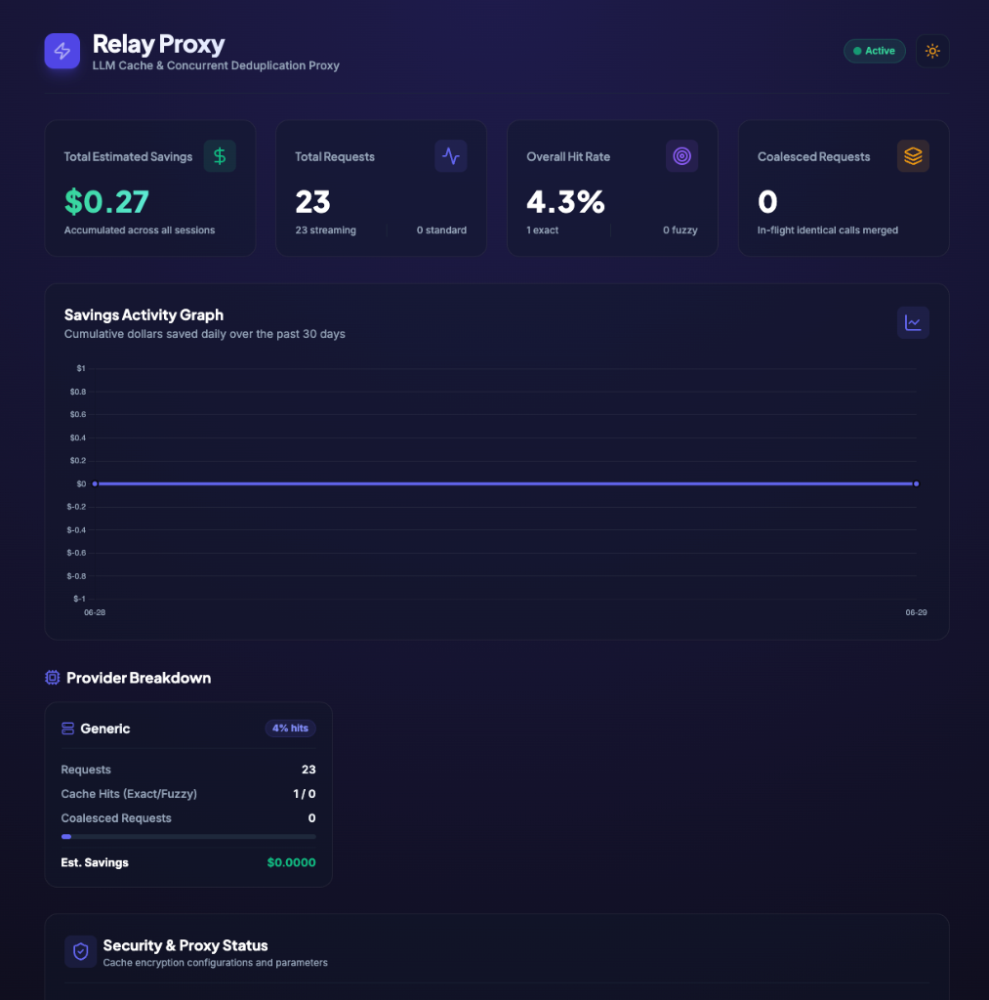
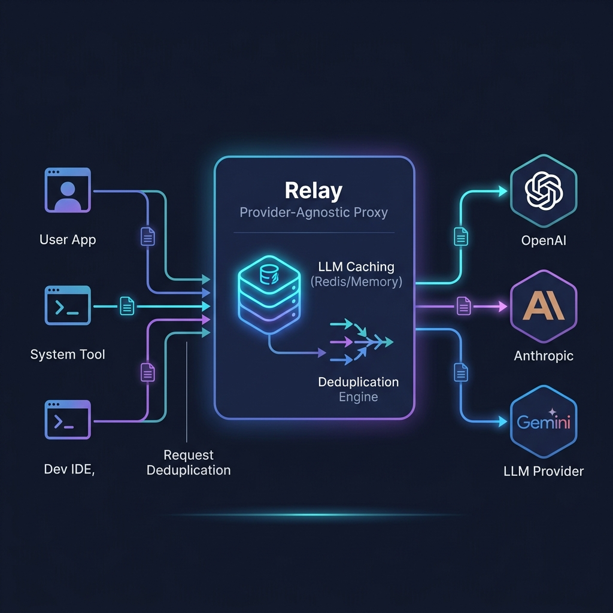

# Relay — Provider-Agnostic LLM Caching Proxy

[](https://opensource.org/licenses/MIT)
[](https://ghcr.io/vrushankpatel/relay)
[](https://github.com/VrushankPatel/relay/releases)
[](https://github.com/VrushankPatel/relay/stargazers)

A transparent caching and deduplication proxy that sits between your application and any LLM API. Reduces costs on pay-per-token APIs (OpenAI, Anthropic, Azure OpenAI) by caching identical requests and deduplicating concurrent in-flight calls.

## Supported Backends

| Backend | Metered? | Caching Saves Money? | Notes |
|---------|----------|---------------------|-------|
| OpenAI API | ✅ Yes | ✅ Yes | All models billed per token |
| Anthropic API | ✅ Yes | ✅ Yes | All Claude models billed per token |
| Azure OpenAI | ✅ Yes | ✅ Yes | Pay-as-you-go or provisioned |
| GitHub Copilot (inline) | ❌ No | ❌ No | Unlimited on paid plans |
| GitHub Copilot (Chat/Agent) | ⚠️ Partially | ⚠️ Limited | Premium models use credits |
| Self-hosted (Ollama, vLLM) | ❌ No | ❌ No | You own the GPU |

## Features

- **Exact Caching**: Cache identical requests to save costs and reduce latency.
- **Prefix Caching**: Intelligently reuse common prompt prefixes across different requests.
- **Streaming Deduplication**: Collapse concurrent in-flight requests into a single upstream request, multicasting the streaming response to all clients.
- **Safe Fuzzy Matching**: (Opt-in) Reuse caches for near-identical prompts within a small edit distance.
- **Per-Model Credit Tracking**: Monitor and set token budgets for your usage.
- **Circuit Breaker**: Prevent cascading failures and overload on upstream APIs.
- **Prometheus Metrics**: Monitor usage, cache hit rates, and latency.

## Performance & Latency

By utilizing local memory caching and optimized AES-256-GCM disk serialization, Relay reduces latency of repeating requests to sub-millisecond levels.

| Request State | Latency | Upstream Billing | Upstream API Calls |
| :--- | :--- | :--- | :--- |
| **Cold Request** (Upstream API) | 1,500ms - 3,500ms | 100% tokens billed | 1 (Hit Upstream) |
| **Exact Cache Hit** (Decrypted Local Cache) | **< 5ms** | **0% cost** (Cached) | 0 |
| **Fuzzy Cache Hit** (FuzzyGuard Similarity) | **< 10ms** | **0% cost** (Cached) | 0 |
| **Deduplicated Request** (Concurrent Coalesced) | Dynamic (Single Stream) | **0% extra cost** | 1 (Shared by all clients) |

## Run with Docker

The fastest way to get started is with Docker Compose.

1. Download the sample environment file and rename it to `.env`:
   ```bash
   cp .env.example .env
   ```
2. Edit `.env` to include your provider's API key (e.g., `OPENAI_API_KEY`).
3. Start the proxy:
   ```bash
   docker compose up -d
   ```
The proxy will be available at `http://localhost:9879`.

### Easy Setup for OpenCode & Ollama

If you are using **OpenCode** with a local or cloud **Ollama** model, you can automatically configure both Relay's environment and your global OpenCode settings using our setup helper:

```bash
npm run setup:opencode
```
This script will locate your global OpenCode configuration file (e.g., `~/.config/opencode/opencode.jsonc`), configure it to point to Relay, whitelist your models, and initialize a local `.env` file pointing to Ollama. After running the script, simply start the proxy via Docker (`docker compose up -d`) and launch OpenCode.

**Note:** The current Docker image includes all `v4` features, including robust encrypted cache persistence (AES-256-GCM) and streaming chunk multicast deduplication. The final image size is extremely lightweight (`~73MB` content size) and is based on `node:20-alpine`.

## Installation

### Verify Releases (Recommended)

Relay provides cryptographic checksums and immutable Docker digests to ensure release integrity. This ensures the binary or image you run has not been tampered with.

**For Binaries:**
1. Download the binary for your platform and the `CHECKSUMS.sha256` file from the [GitHub Releases](https://github.com/VrushankPatel/relay/releases) page.
2. Verify the checksum:
   ```bash
   # macOS
   shasum -a 256 -c CHECKSUMS.sha256

   # Linux
   sha256sum -c CHECKSUMS.sha256
   ```

**For Docker:**
Instead of pulling the mutable `latest` tag, pull by the exact SHA-256 digest listed on the GHCR package page:
```bash
docker pull ghcr.io/vrushankpatel/relay@sha256:<digest>
```

### Installation (Node)

If you prefer running natively without Docker, you can configure and build the application.

1. Install and build Relay:
   
   Using Make:
   ```bash
   make install
   make build
   ```
   
   Or using npm:
   ```bash
   npm install
   npm run build
   ```
2. Configure your provider (e.g., OpenAI) in `config.yaml`:
   ```yaml
   server:
     port: 3000

   provider:
     type: openai
     # apiKey: sk-... # or set OPENAI_API_KEY
   ```
3. Start the proxy:
   ```bash
   # Foreground mode (default)
   relay start
   # or
   npm start

   # Daemon mode (run in the background)
   relay start --daemon
   ```

## Live Dashboard

Relay includes a built-in, real-time analytics dashboard in both dark and light modes. It shows your cumulative credit savings, exact and fuzzy cache hit rates, concurrent deduplication statistics, and detailed provider breakdown telemetry:



## Architecture

Relay acts as a transparent proxy between your LLM clients and the upstream providers:



The provider translation layer allows Relay to cleanly support multiple upstream APIs while presenting a uniform local endpoint.

## Client Tool Support

Relay natively integrates with standard AI client tools:

| Client Tool | Auth Mode | Status | Setup Walkthrough |
|-------------|-----------|--------|-------------------|
| **Claude Code** | API Key (`ANTHROPIC_AUTH_TOKEN`) | ✅ Supported | [USAGE.md Guide](./USAGE.md#1-claude-code-cli) |
| **OpenCode** | API Key (`opencode.openai.apiKey`) | ✅ Supported | [USAGE.md Guide](./USAGE.md#2-opencode) |
| **Google Gemini CLI** | API Key (`GEMINI_BASE_URL`) | ✅ Supported | [USAGE.md Guide](./USAGE.md#5-google-gemini-cli) |
| **Cline** | API Key (OpenAI Compatible) | ✅ Supported | [USAGE.md Guide](./USAGE.md#3-cline-vs-code-extension) |
| **Aider** | API Key (`OPENAI_API_BASE`) | ✅ Supported | [USAGE.md Guide](./USAGE.md#4-aider) |
| **GitHub Copilot CLI** | N/A | ❌ Not Possible | [COMPLIANCE.md Notice](./COMPLIANCE.md#explicit-non-targets) |
| **Kiro** | N/A | ⏳ Deferred | [COMPLIANCE.md Notice](./COMPLIANCE.md#explicit-non-targets) |
| **Antigravity CLI** | N/A | ⏳ Deferred | [COMPLIANCE.md Notice](./COMPLIANCE.md#explicit-non-targets) |

## ⚠️ GitHub Copilot Notice

While Relay supports a `copilot` provider type, this is **NOT** the primary use case. Please read our [Compliance & Terms of Service Notice](./COMPLIANCE.md) before considering this backend.
